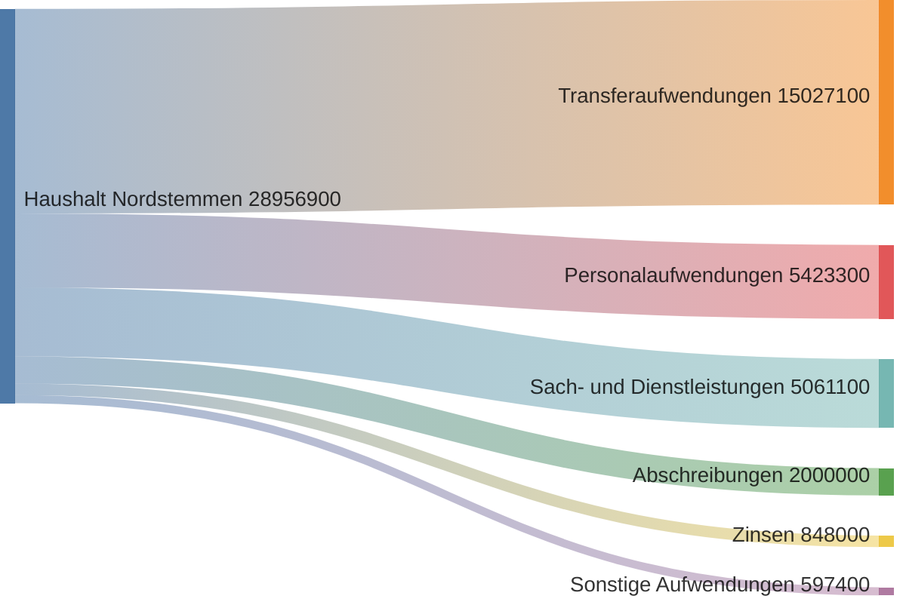
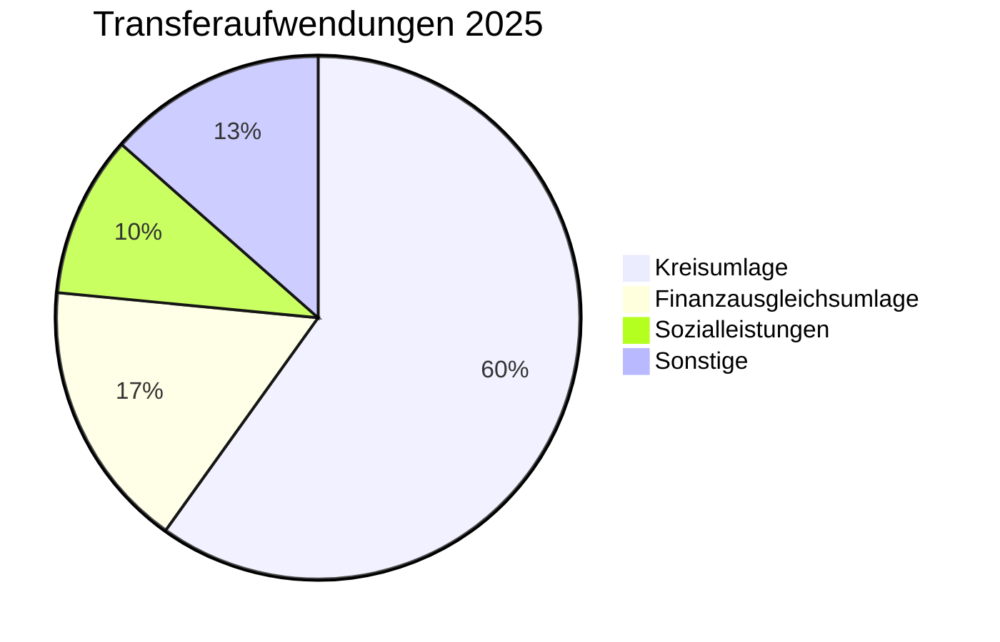
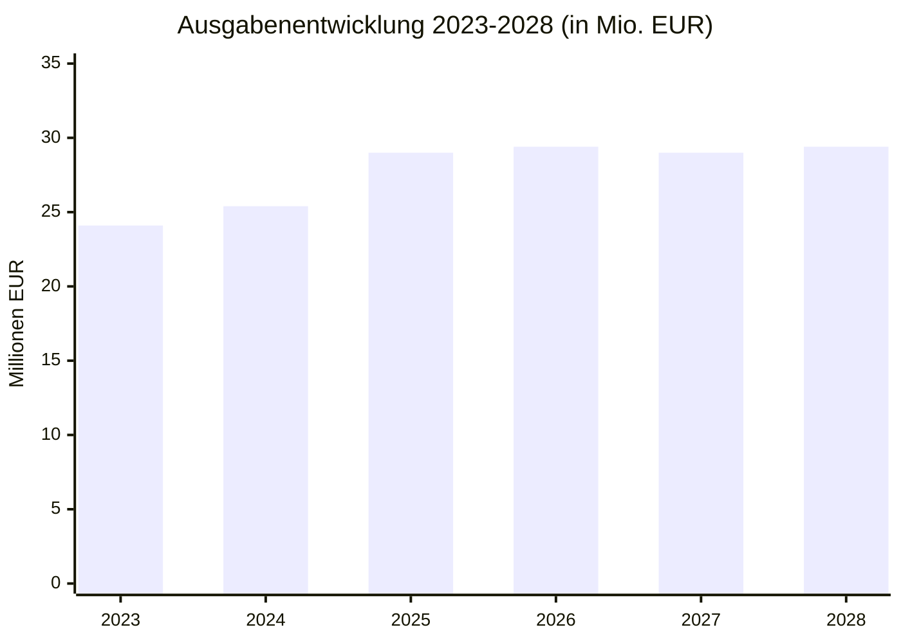

# Ausgaben 2025

Die Gemeinde Nordstemmen plant für 2025 ordentliche Aufwendungen von **28.956.900 EUR**.

## Ausgabenstruktur

## Detailübersicht Ausgaben

### 1. Transferaufwendungen (15,0 Mio. EUR)

Der größte Ausgabenblock - Zahlungen an andere Gebietskörperschaften und Empfänger.

| Art | Betrag | Beschreibung |
|-----|--------|--------------|
| **Kreisumlage** | ca. 9.000.000 EUR | Umlage an den Landkreis Hildesheim |
| **Gewerbesteuerumlage** | ca. 500.000 EUR | Umlage an Bund und Land |
| **Finanzausgleichsumlage** | ca. 2.500.000 EUR | Umlagen im kommunalen Finanzausgleich |
| **Sozialleistungen** | ca. 1.500.000 EUR | Jugendhilfe, Kindertagesbetreuung |
| **Sonstige Transfers** | ca. 1.500.000 EUR | Zuschüsse an Vereine, Verbände |

### 2. Personalaufwendungen (5,4 Mio. EUR)

Kosten für die Beschäftigten der Gemeinde.

| Position | Betrag |
|----------|--------|
| **Tariflich Beschäftigte** | ca. 3.500.000 EUR |
| **Beamte** | ca. 300.000 EUR |
| **Versorgungskassenbeiträge** | ca. 600.000 EUR |
| **Sozialversicherung** | ca. 700.000 EUR |
| **Sonstige Personalkosten** | ca. 300.000 EUR |

### 3. Aufwendungen für Sach- und Dienstleistungen (5,1 Mio. EUR)

| Bereich | Beispiele |
|---------|-----------|
| **Unterhaltung Gebäude** | Reparaturen, Wartung von Schulen, Kitas, Rathaus |
| **Unterhaltung Straßen** | Straßenreparaturen, Winterdienst |
| **Bewirtschaftung** | Strom, Heizung, Wasser, Reinigung |
| **Geschäftsbedarf** | Büromaterial, IT, Telefon |
| **Dienstleistungen** | Externe Beratung, Rechtskosten |

### 4. Abschreibungen (2,0 Mio. EUR)

Planmäßige Abschreibungen auf das Anlagevermögen:

- Gebäude
- Straßen und Wege
- Technische Anlagen
- Fahrzeuge und Geräte

### 5. Zinsen und ähnliche Aufwendungen (848 TEUR)

Zinsaufwendungen für aufgenommene Kredite. **Tendenz steigend** aufgrund des Zinsniveaus und neuer Kreditaufnahmen.

### 6. Sonstige ordentliche Aufwendungen (597 TEUR)

| Art | Beispiele |
|-----|-----------|
| **Versicherungen** | Gebäudeversicherung, Haftpflicht |
| **Beiträge** | Mitgliedschaften in Verbänden |
| **Steuern** | Grunderwerbsteuer |

## Investitionen 2025

Zusätzlich zu den laufenden Ausgaben sind **Investitionen von 5,9 Mio. EUR** geplant:

| Bereich | Betrag |
|---------|--------|
| **Baumaßnahmen** | ca. 4.500.000 EUR |
| **Erwerb von Grundstücken** | ca. 500.000 EUR |
| **Fahrzeuge und Geräte** | ca. 400.000 EUR |
| **IT und Ausstattung** | ca. 500.000 EUR |

## Entwicklung der Ausgaben

## Quellen

- [Ergebnishaushalt 2025 (DS 89/2024)](https://nordstemmen-mcp.levinkeller.de/pdf/f42578e8afb5426b404363f3bf140512e7a63a0095b1110131ab566468b694ef)
- [Finanzhaushalt 2025](https://nordstemmen-mcp.levinkeller.de/pdf/8c9078d971c2d9d8dc312fa66ad2fa767aab9b9bd6159b17c4bcf3946cf32218)
