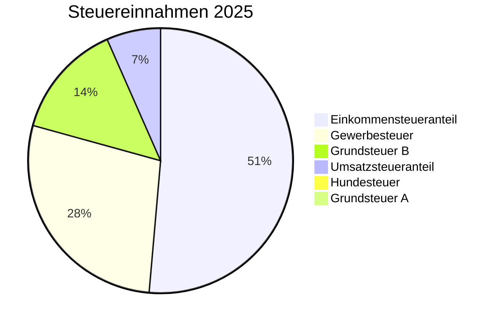
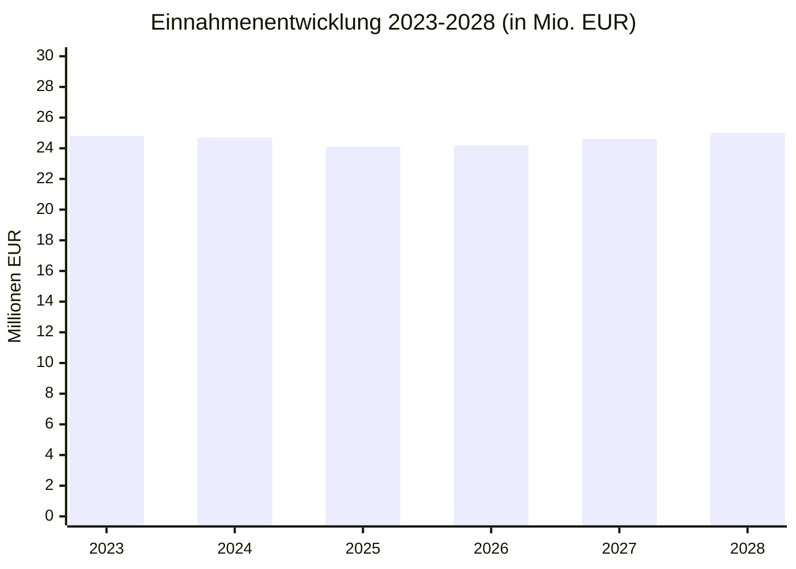

# Einnahmen 2025

Die Gemeinde Nordstemmen erwartet für 2025 ordentliche Erträge von **24.083.800 EUR**.

## Einnahmenstruktur

```mermaid
sankey-beta

Steuern und Abgaben,Haushalt Nordstemmen,14173300
Zuwendungen und Umlagen,Haushalt Nordstemmen,5662800
Öffentlich-rechtliche Entgelte,Haushalt Nordstemmen,3059600
Auflösungserträge Sonderposten,Haushalt Nordstemmen,795500
Privatrechtliche Entgelte,Haushalt Nordstemmen,208000
Kostenerstattungen,Haushalt Nordstemmen,118100
Zinserträge,Haushalt Nordstemmen,66500
```

## Detailübersicht Einnahmen

### 1. Steuern und ähnliche Abgaben (14,2 Mio. EUR)

Die größte Einnahmequelle der Gemeinde.

| Steuerart | Betrag | Hebesatz |
|-----------|--------|----------|
| **Gewerbesteuer** | ca. 3.800.000 EUR | 420 v.H. |
| **Grundsteuer B** | ca. 1.921.500 EUR | 360 v.H. |
| **Gemeindeanteil Einkommensteuer** | ca. 7.000.000 EUR | - |
| **Gemeindeanteil Umsatzsteuer** | ca. 900.000 EUR | - |
| **Grundsteuer A** | ca. 60.000 EUR | 440 v.H. |
| **Hundesteuer** | ca. 89.250 EUR | - |
| **Sonstige Steuern** | ca. 400.000 EUR | - |



### 2. Zuwendungen und allgemeine Umlagen (5,7 Mio. EUR)

Zuweisungen vom Land Niedersachsen und anderen Stellen.

| Art | Betrag |
|-----|--------|
| **Schlüsselzuweisungen** | ca. 4.500.000 EUR |
| **Investitionszuweisungen** | ca. 500.000 EUR |
| **Sonstige Zuweisungen** | ca. 700.000 EUR |

### 3. Öffentlich-rechtliche Entgelte (3,1 Mio. EUR)

Gebühren und Beiträge für gemeindliche Leistungen.

| Art | Beispiele |
|-----|-----------|
| **Abwassergebühren** | Schmutz- und Niederschlagswasser |
| **Friedhofsgebühren** | Bestattungen, Grabnutzung |
| **Verwaltungsgebühren** | Bescheinigungen, Genehmigungen |
| **Kindergartengebühren** | Betreuungsangebote |

### 4. Auflösungserträge aus Sonderposten (796 TEUR)

Planmäßige Auflösung von Sonderposten für erhaltene Investitionszuschüsse.

### 5. Privatrechtliche Entgelte (208 TEUR)

| Art | Beispiele |
|-----|-----------|
| **Mieteinnahmen** | Gemeindliche Gebäude |
| **Pachteinnahmen** | Grundstücke |
| **Verkaufserlöse** | Verschiedene Verkäufe |

### 6. Kostenerstattungen (118 TEUR)

Erstattungen von anderen Kommunen und Institutionen.

### 7. Zinsen und ähnliche Finanzerträge (67 TEUR)

Zinserträge aus Geldanlagen und Darlehen.

## Entwicklung der Einnahmen



## Quellen

- [Ergebnishaushalt 2025 (DS 89/2024)](https://nordstemmen-mcp.levinkeller.de/pdf/f42578e8afb5426b404363f3bf140512e7a63a0095b1110131ab566468b694ef)
- [Haushaltssicherungskonzept 2025](https://nordstemmen-mcp.levinkeller.de/pdf/4130a7444718a273a436636a1c7e44a73130f5c7467a577051ff8c92ec4efbc3)
