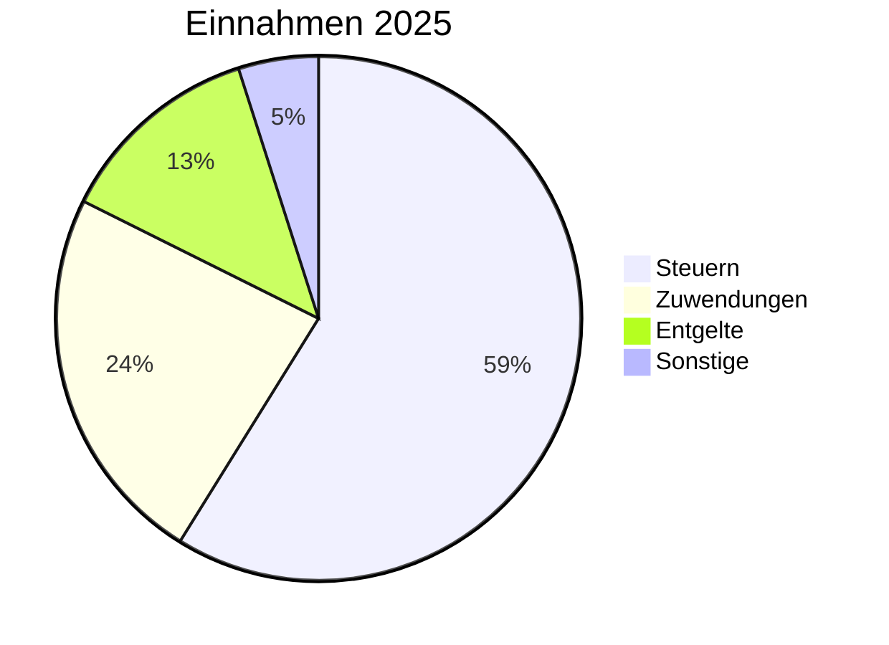
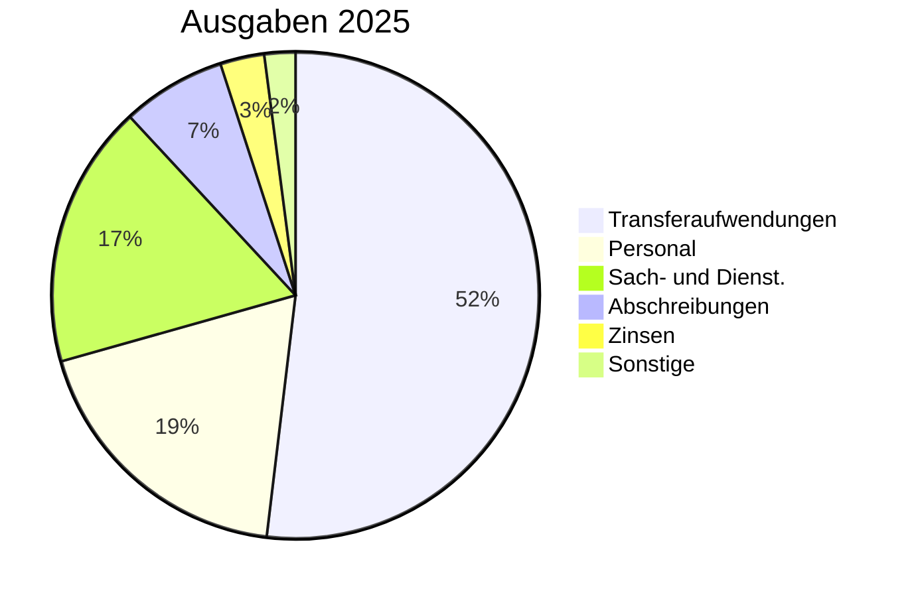

# Haushalt 2025 - Übersicht

Der Haushaltsplan 2025 wurde vom Rat der Gemeinde Nordstemmen am **17. Dezember 2024** beschlossen.

## Eckdaten

| Position | Betrag |
|----------|--------|
| **Ordentliche Erträge** | 24.083.800 EUR |
| **Ordentliche Aufwendungen** | 28.956.900 EUR |
| **Ordentliches Ergebnis** | -4.873.100 EUR |
| **Investitionsauszahlungen** | 5.956.200 EUR |
| **Kreditaufnahme** | 1.697.800 EUR |

## Haushaltssicherung

Die Gemeinde befindet sich in der Haushaltssicherung. Es wurde ein [Haushaltssicherungskonzept](https://nordstemmen-mcp.levinkeller.de/pdf/f42578e8afb5426b404363f3bf140512e7a63a0095b1110131ab566468b694ef) erstellt.

### Maßnahmen zur Haushaltskonsolidierung

| Maßnahme | Jährliche Einsparung/Mehreinnahme |
|----------|-----------------------------------|
| Erhöhung Grundsteuer B (auf 360 v.H.) | 87.000 EUR |
| Erhöhung Gewerbesteuer (auf 420 v.H.) | 250.000 EUR |
| Anpassung Hundesteuer | 19.700 EUR |
| Anpassung Friedhofsgebühren | 3.000 EUR |

## Haushaltsstruktur

## Vergleich mit Vorjahr

| Position | 2024 | 2025 | Veränderung |
|----------|------|------|-------------|
| Steuern | 13,4 Mio. | 14,2 Mio. | +5,4% |
| Personalaufwand | 5,0 Mio. | 5,4 Mio. | +8,0% |
| Transferaufwand | 14,2 Mio. | 15,0 Mio. | +5,6% |
| Fehlbetrag | -0,7 Mio. | -4,9 Mio. | -600% |

## Quellen

- [Drucksache DS 89/2024 - Haushaltsplan 2025](https://nordstemmen-mcp.levinkeller.de/pdf/f42578e8afb5426b404363f3bf140512e7a63a0095b1110131ab566468b694ef)
- [Ergebnishaushalt 2025](https://nordstemmen-mcp.levinkeller.de/pdf/a3c42c96326be36472ea24da68e3f56e4e49d9c6b9125ccabe2d52e14a54a420)
