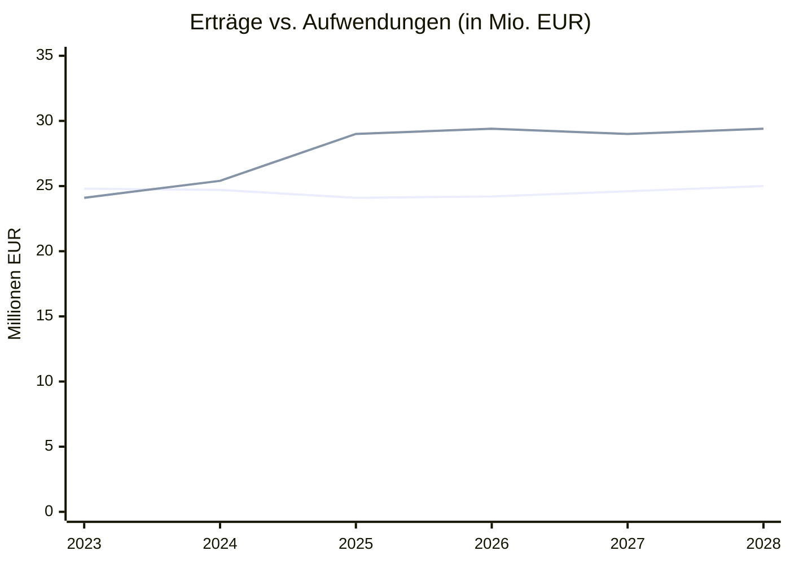
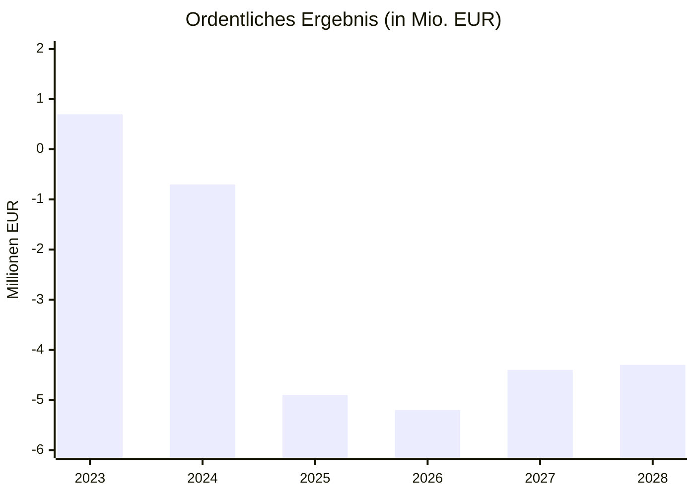
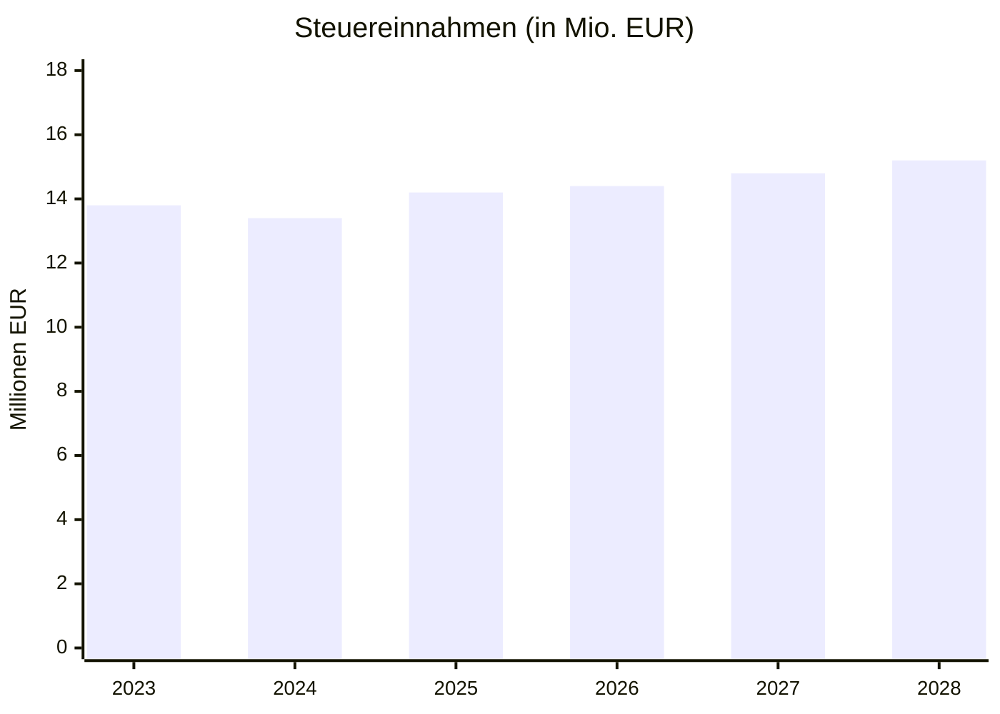
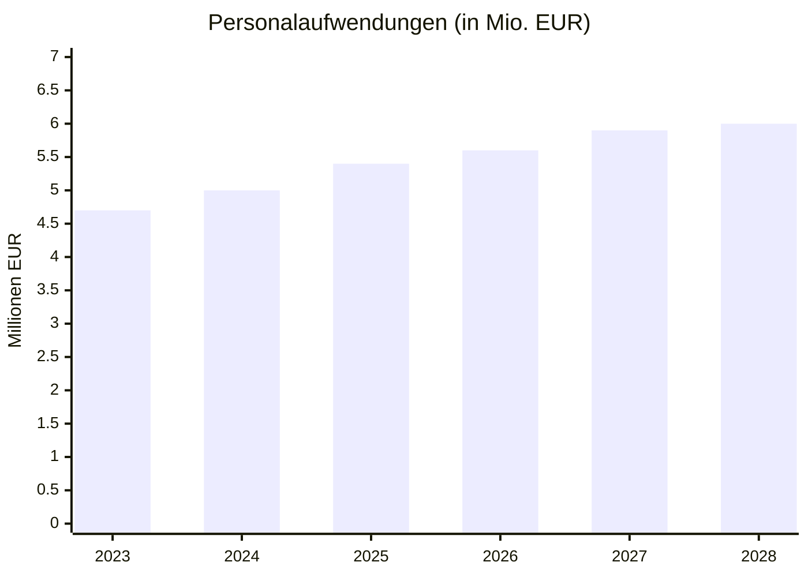
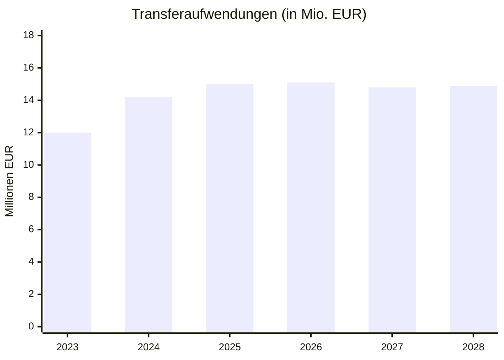
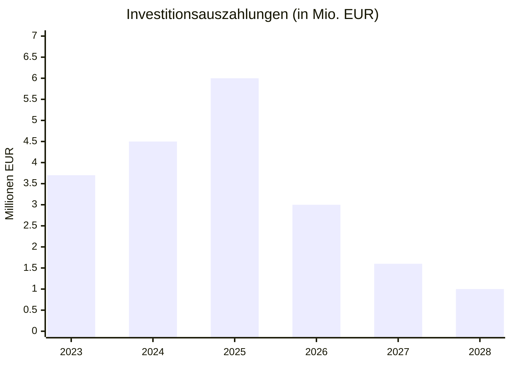
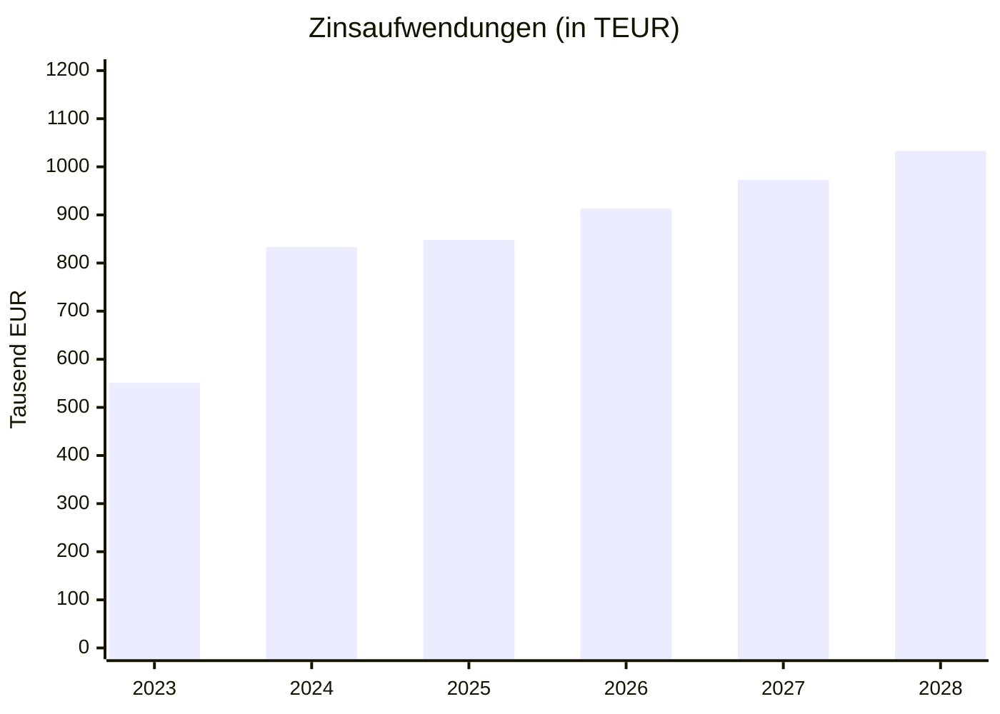

# Zeitreihen - Entwicklung des Haushalts

Diese Seite zeigt die Entwicklung wichtiger Haushaltskennzahlen über mehrere Jahre.

## Gesamtentwicklung 2023-2028

**Legende:** Obere Linie = Erträge, Untere Linie = Aufwendungen

## Jahresergebnis (Saldo)

| Jahr | Erträge | Aufwendungen | Ergebnis |
|------|---------|--------------|----------|
| 2023 | 24.849.370 | 24.110.625 | +738.745 |
| 2024 | 24.657.000 | 25.381.600 | -724.600 |
| 2025 | 24.083.800 | 28.956.900 | -4.873.100 |
| 2026 | 24.163.400 | 29.350.700 | -5.187.300 |
| 2027 | 24.600.600 | 29.034.800 | -4.434.200 |
| 2028 | 25.028.300 | 29.369.200 | -4.340.900 |

## Steuereinnahmen

| Jahr | Steuern gesamt | Davon Gewerbesteuer |
|------|----------------|---------------------|
| 2023 | 13.783.548 | ca. 3.500.000 |
| 2024 | 13.446.200 | ca. 3.550.000 |
| 2025 | 14.173.300 | ca. 3.800.000 |
| 2026 | 14.360.900 | ca. 3.800.000 |
| 2027 | 14.808.800 | ca. 3.800.000 |
| 2028 | 15.223.600 | ca. 3.800.000 |

## Personalaufwendungen

| Jahr | Personalaufwand | Veränderung zum Vorjahr |
|------|-----------------|-------------------------|
| 2023 | 4.692.802 | - |
| 2024 | 5.023.400 | +7,0% |
| 2025 | 5.423.300 | +8,0% |
| 2026 | 5.595.600 | +3,2% |
| 2027 | 5.866.100 | +4,8% |
| 2028 | 6.036.500 | +2,9% |

**Treiber der Personalkosten:**
- Tarifsteigerungen im öffentlichen Dienst
- Ausbau der Kindertagesbetreuung
- Zusätzliches Personal für neue Aufgaben

## Transferaufwendungen

Die größte Ausgabenposition - hauptsächlich Kreisumlage:

## Investitionen

| Jahr | Investitionen | Schwerpunkte |
|------|---------------|--------------|
| 2023 | 3.655.756 | Laufende Maßnahmen |
| 2024 | 4.549.000 | Schulen, Kitas |
| 2025 | 5.956.200 | Baumaßnahmen, Kita-Ausbau |
| 2026 | 2.952.700 | Abschluss laufender Projekte |
| 2027 | 1.583.200 | Reduzierte Neuinvestitionen |
| 2028 | 1.032.500 | Konsolidierungsphase |

## Zinsaufwendungen

**Trend:** Die Zinslasten steigen aufgrund:
- Höherer Zinssätze am Kapitalmarkt
- Neue Kreditaufnahmen zur Defizitfinanzierung

## Datenquellen

Die Zeitreihen basieren auf:
- Jahresrechnungen (Ist-Werte)
- Haushaltsplänen (Plan-Werte)
- Mittelfristige Finanzplanung

Alle Daten sind in [`data/haushalt_nordstemmen.yaml`](https://github.com/levino/haushalt-nordstemmen/blob/main/data/haushalt_nordstemmen.yaml) dokumentiert.
